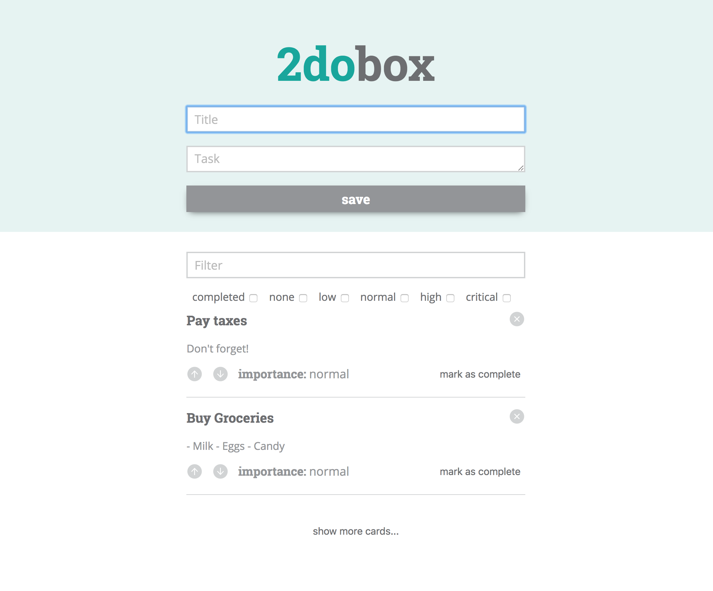

# 2DoBox

## Synopsis

2DoBox is a to do list web app that keeps track of your to dos. 

### *Inspiration:* 

Turing School of Software & Design Front-End Engineering Project - Mod 1: Given another student's code base from the [IdeaBox project](http://frontend.turing.io/projects/ideabox.html), refactor and pivot to create [2DoBox](http://frontend.turing.io/projects/2DoBox-Pivot-Mod1.html). 

### *Our Comp:* 

---

## Contributors

[Sage Vogt](https://github.com/SageVanGogt) & Daniela Carey
